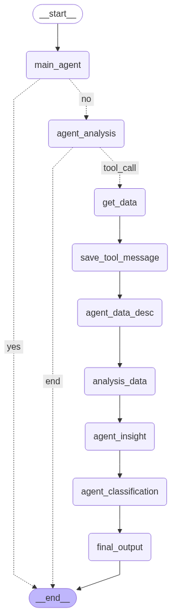

# 🛠️ Backend Documentation

## 📦 Overview

Backend aplikasi ini dibangun menggunakan **Python** dengan framework utama **FastAPI** dan didukung oleh teknologi AI modern seperti **LangChain** dan **LangGraph**. Backend bertugas sebagai otak utama AI agent, memproses permintaan user, melakukan analisis data, menyimpan memory percakapan, dan mengelola workflow multi-agent.

---

## 🚀 Teknologi Utama

### 1. **FastAPI**
Framework web modern, cepat, dan asinkron untuk membangun REST API di Python. Mendukung auto-documentation (Swagger/OpenAPI) dan validasi input dengan Pydantic.

### 2. **LangChain**
Framework open-source untuk membangun aplikasi berbasis Large Language Model (LLM). LangChain memudahkan integrasi LLM dengan tools, memory, dan workflow yang kompleks.

### 3. **LangGraph** (Fitur Unggulan & Penjelasan)
**LangGraph** adalah framework baru yang dikembangkan oleh tim LangChain untuk membangun **stateful, multi-agent, dan multi-step workflows** pada aplikasi AI.  
**Fitur utama LangGraph:**
- **State Machine untuk AI**: Setiap langkah (node) dalam workflow bisa berupa agent, tool, atau proses lain.
- **Memory Persistence**: Mendukung memory conversation yang persist (misal: MemorySaver).
- **Conditional Routing**: Workflow bisa bercabang sesuai hasil reasoning agent.
- **Visualisasi Workflow**: Mendukung visualisasi alur kerja (graph) untuk debugging dan dokumentasi.
- **Integrasi dengan LangChain**: Bisa menggunakan semua tools, memory, dan LLM yang didukung LangChain.



**Contoh Penggunaan di Project Ini:**
- Setiap node di LangGraph mewakili proses seperti: main agent, analisis data, deskripsi data, insight, klasifikasi, hingga final output.
- MemorySaver digunakan untuk menyimpan riwayat percakapan (threaded memory).
- Routing otomatis: jika pertanyaan user bisa dijawab langsung, agent akan menjawab; jika butuh analisis data, workflow akan lanjut ke node analisis.

### 4. **Pandas, NumPy, SciPy**
Digunakan untuk manipulasi data, perhitungan statistik, dan uji distribusi data.

### 5. **OpenAI & Replicate**
- **OpenAI GPT**: Untuk reasoning, penjelasan, dan insight.
- **Replicate (IBM Granite)**: Untuk klasifikasi data.

---

## 🏗️ Struktur Backend

```
Backend/
├── main.py                 # Entry point FastAPI
├── agent/
│   ├── __init__.py         # Wrapper MyAgent
│   ├── workflow.py         # Implementasi LangGraph workflow
│   ├── prompts.py          # Prompt untuk LLM
│   ├── tools.py            # Tools analisis statistik
│   ├── models.py           # Pydantic models
│   └── utils/
│       └── data_format.py  # Utility formatting data
├── data/
│   └── pengeluaran.csv     # Contoh data pengeluaran
├── pyproject.toml          # Dependencies Python
└── README.md               # Dokumentasi backend
```

---

## ⚙️ Cara Menjalankan Backend

### 1. **Install Dependencies**
```bash
pip install uv
# menggunakan uv
uv sync
```

### 2. **Set Environment Variables**
- Buat file `.env` dan isi dengan API key OpenAI dan Replicate.

### 3. **Jalankan Server**
```bash
python main.py
# Server berjalan di http://127.0.0.1:8080
```

---

## 🧠 Fitur Backend

### 1. **Multi-Agent Workflow**
- Setiap permintaan user diproses melalui workflow LangGraph.
- Routing otomatis: pertanyaan sederhana dijawab langsung, analisis data dilakukan jika diperlukan.

### 2. **Memory Percakapan**
- Menggunakan `MemorySaver` dari LangGraph.
- Setiap user/thread punya memory sendiri, sehingga agent bisa mengingat percakapan sebelumnya.

### 3. **Analisis Statistik Otomatis**
- Mean, median, modus, standar deviasi, varian, jangkauan, uji distribusi normal (Shapiro-Wilk).
- Analisis per kategori dan keseluruhan.

### 4. **Klasifikasi Pengeluaran**
- Klasifikasi otomatis (BOROS/NORMAL) berdasarkan threshold.
- Output dalam format tabel ASCII.

### 5. **Insight & Rekomendasi**
- Agent memberikan insight dan rekomendasi berdasarkan hasil analisis data.

---

## 🛠️ API Endpoint

### **POST `/api/agent`**
- Endpoint utama untuk interaksi dengan AI agent.
- Input: `{ "user_message": "..." }`
- Output: `{ "user_message": "...", "response": "..." }`

### **GET `/`**
- Health check endpoint.

---

## 📚 Referensi & Sumber Belajar

- [LangGraph Documentation](https://langchain-ai.github.io/langgraph/)
- [LangChain Documentation](https://python.langchain.com/)
- [FastAPI Documentation](https://fastapi.tiangolo.com/)
- [Replicate Documentation](https://replicate.com/docs)
- [OpenAI API](https://platform.openai.com/docs/)

---

## ❓ FAQ

**Q: Apa keunggulan LangGraph dibanding workflow manual?**  
A: LangGraph memudahkan pembuatan workflow AI yang kompleks, stateful, dan multi-step, serta mendukung memory dan visualisasi alur kerja.

**Q: Apakah backend ini bisa di-scale?**  
A: Ya, FastAPI mendukung deployment di berbagai platform (Docker, cloud, dsb) dan LangGraph mendukung multi-threaded memory.

---

*Dokumentasi ini akan terus diperbarui sesuai perkembangan teknologi dan fitur backend project ini.*
