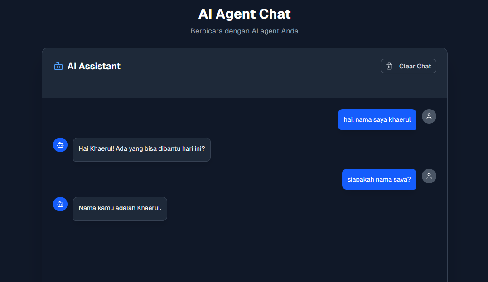
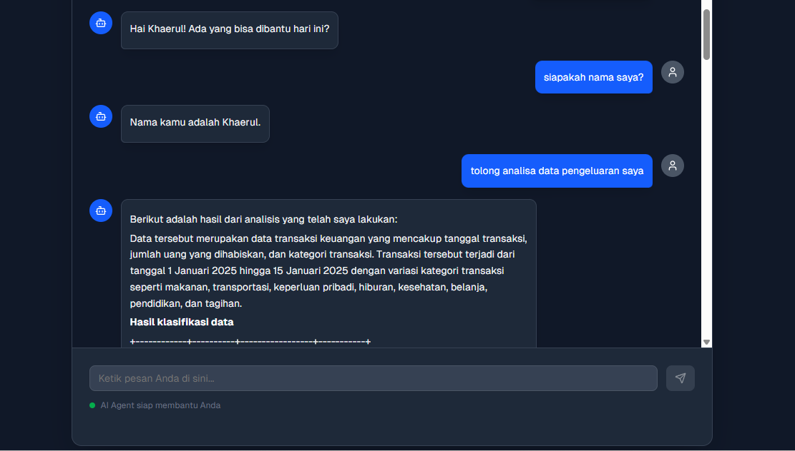
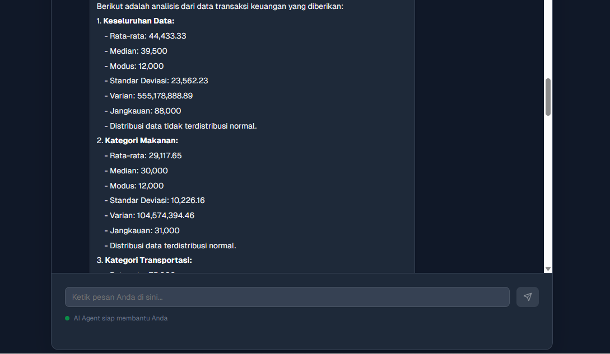
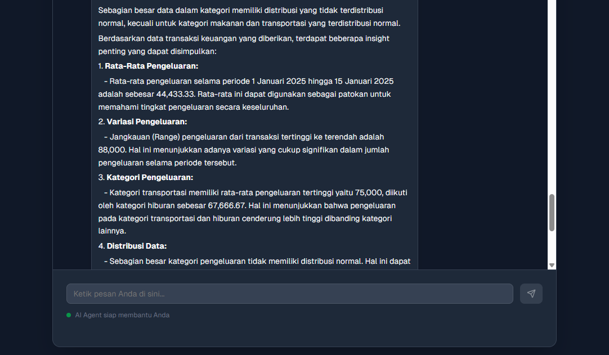
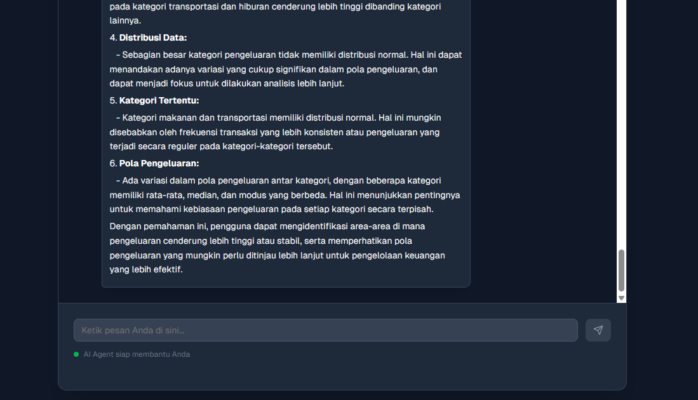
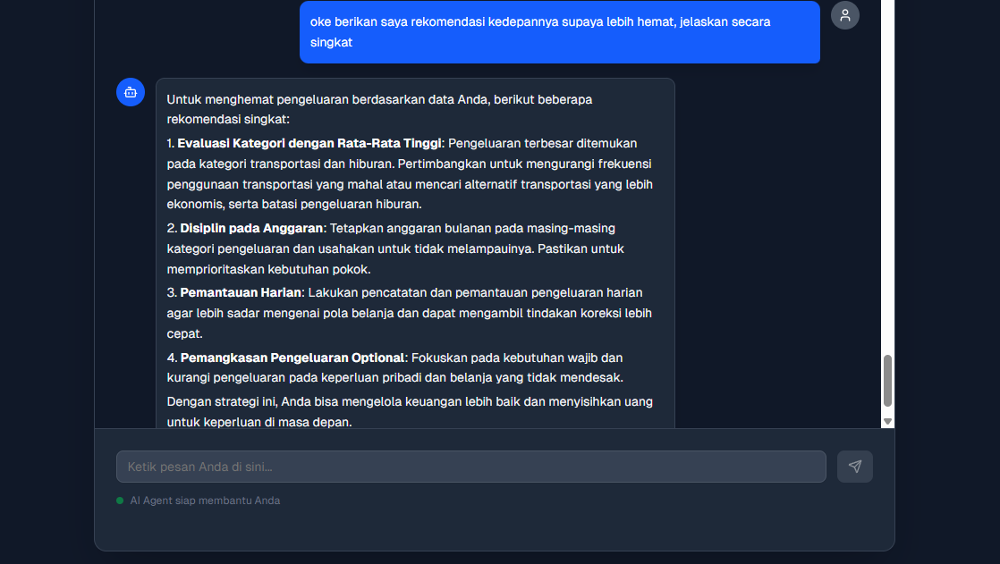
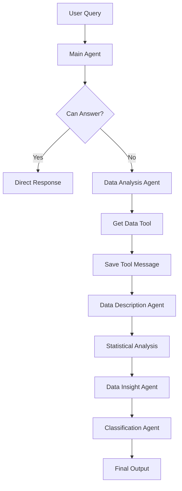

# 📊 AI Agent Analisis Pengeluaran Harian

Sebuah aplikasi AI Agent cerdas yang dapat menganalisis data pengeluaran harian dengan berbagai fitur analisis statistik, klasifikasi, dan memberikan insight serta rekomendasi yang tepat berdasarkan data pengeluaran.

## 📱 Demo App

Berikut adalah demonstrasi lengkap fitur-fitur AI Agent dalam menganalisis data pengeluaran:

### 1. Memory System - Mengingat Percakapan Sebelumnya


**Fitur Memory yang Powerful**: AI Agent dilengkapi dengan sistem memory yang dapat mengingat informasi dari percakapan sebelumnya. Pada demo ini terlihat:
- User memperkenalkan diri: "nama saya khaerul"
- Ketika ditanya kembali "siapa nama saya?", agent dengan tepat menjawab "Nama kamu adalah Khaerul"
- Ini menunjukkan bahwa agent dapat mempertahankan konteks percakapan untuk pengalaman yang lebih personal

### 2. Deskripsi Data Otomatis


**Analisis Awal Data**: Ketika user meminta "tolong analisa data pengeluaran saya", AI Agent memulai dengan:
- **Identifikasi struktur data** pengeluaran yang mencakup tanggal, jumlah, dan kategori transaksi
- **Periode analisis** dari 1 Januari 2025 hingga 15 Januari 2025
- **Klasifikasi kategori** seperti makanan, transportasi, keperluan pribadi, hiburan, kesehatan, belanja, pendidikan, dan tagihan
- Memberikan **konteks yang jelas** sebelum melakukan analisis mendalam

### 3. Analisis Statistik Komprehensif


**Uji Statistik Lengkap**: Agent melakukan perhitungan statistik detail meliputi:

**Keseluruhan Data:**
- Rata-rata: 44,433.33
- Median: 39,500
- Modus: 12,000
- Standar Deviasi: 23,562.23
- Varian: 555,178,888.89
- Jangkauan: 88,000
- **Uji Distribusi Normal**: Data tidak terdistribusi normal

**Per Kategori Analisis:**
- **Makanan**: Rata-rata 29,117.65 (distribusi normal)
- **Transportasi**: Rata-rata tertinggi menunjukkan pengeluaran besar di kategori ini

### 4. Insight Mendalam dari Data


**Generasi Insight Cerdas**: Berdasarkan analisis statistik, agent memberikan insights penting:

1. **Rata-Rata Pengeluaran**: 44,433.33 sebagai patokan untuk memahami tingkat pengeluaran keseluruhan
2. **Variasi Pengeluaran**: Jangkauan 88,000 menunjukkan variasi signifikan dalam jumlah pengeluaran
3. **Kategori Pengeluaran**: Transportasi memiliki rata-rata tertinggi (75,000), diikuti hiburan (67,666.67)
4. **Distribusi Data**: Mayoritas kategori tidak memiliki distribusi normal, menandakan variasi signifikan dalam pola pengeluaran

### 5. Analisis Pola Pengeluaran Lanjutan


**Identifikasi Pola Kompleks**: Agent menganalisis pola yang lebih mendalam:

1. **Kategori Tertentu**: Makanan dan transportasi memiliki distribusi normal (pengeluaran konsisten)
2. **Variasi dalam Pola**: Adanya variasi dalam pola pengeluaran antar kategori dengan rata-rata, median, dan modus yang berbeda
3. **Focus Area**: Mengidentifikasi area di mana pengeluaran cenderung lebih tinggi atau stabil untuk pengambilan keputusan yang lebih efektif

### 6. Rekomendasi Strategis untuk Penghematan


**Saran Actionable**: Ketika ditanya "berikan saya rekomendasi kedepannya supaya lebih hemat", agent memberikan strategi konkret:

1. **Evaluasi Kategori dengan Rata-Rata Tinggi**: 
   - Fokus pada transportasi dan hiburan
   - Kurangi frekuensi atau cari alternatif lebih ekonomis
   
2. **Disiplin pada Anggaran**: 
   - Tetapkan anggaran bulanan per kategori
   - Usahakan tidak melampaui batas yang ditetapkan
   
3. **Pemantauan Harian**: 
   - Pencatatan dan pemantauan pengeluaran harian
   - Monitoring pola belanja untuk tindakan korektif cepat
   
4. **Pemangkasan Pengeluaran Optional**: 
   - Fokus pada kebutuhan wajib
   - Kurangi pengeluaran non-esensial seperti keperluan pribadi dan belanja

---

*Demo ini menunjukkan kemampuan AI Agent dalam memberikan analisis yang komprehensif, mulai dari pemahaman data hingga rekomendasi actionable untuk pengelolaan keuangan yang lebih baik.*

## 🌟 Fitur Utama

### 🤖 AI Agent dengan Memory
- **Conversational AI**: Agent yang dapat berinteraksi secara natural dengan pengguna
- **Persistent Memory**: Mengingat riwayat percakapan sebelumnya menggunakan LangGraph MemorySaver
- **Multi-Agent Architecture**: Sistem dengan beberapa agent spesialis untuk tugas berbeda

### 📈 Analisis Data Komprehensif
- **Analisis Statistik Lengkap**:
  - Mean (rata-rata)
  - Median (nilai tengah)
  - Modus (nilai yang paling sering muncul)
  - Standard Deviation (simpangan baku)
  - Variance (varian)
  - Range (jangkauan: max - min)
  - **Uji Distribusi Normal** menggunakan Shapiro-Wilk test

### 🏷️ Klasifikasi Otomatis
- **Klasifikasi Pengeluaran**:
  - **BOROS**: Pengeluaran > Rp 50.000
  - **NORMAL**: Pengeluaran ≤ Rp 50.000
- **Output Format Tabel**: Hasil klasifikasi dalam format tabel ASCII yang rapi
- **Ringkasan**: Total transaksi BOROS vs NORMAL

### 💡 Insight dan Rekomendasi
- **Data Insight**: Analisis mendalam terhadap pola pengeluaran
- **Rekomendasi Pintar**: Saran berdasarkan analisis data pengeluaran
- **Deteksi Anomali**: Identifikasi pola pengeluaran yang tidak biasa

## 🏗️ Arsitektur Sistem

### Backend (Python)
```
Backend/
├── main.py                 # FastAPI server utama
├── agent/
│   ├── __init__.py        # MyAgent class wrapper
│   ├── workflow.py        # LangGraph workflow implementation
│   ├── prompts.py         # AI prompts untuk berbagai agent
│   ├── tools.py           # Tools untuk analisis statistik
│   ├── models.py          # Pydantic models untuk data structure
│   └── utils/
│       └── data_format.py # Utilities untuk formatting data
├── data/
│   └── pengeluaran.csv    # Sample data pengeluaran
└── pyproject.toml         # Project dependencies
```

### Frontend (Next.js + TypeScript)
```
Frontend/
├── app/
│   ├── page.tsx           # Main chat interface
│   ├── layout.tsx         # App layout
│   └── globals.css        # Global styles
├── components/            # React components
├── lib/                   # Utility functions
└── package.json           # Frontend dependencies
```

## 🔧 Teknologi yang Digunakan

### Backend
- **FastAPI**: Web framework untuk API
- **LangChain**: Framework untuk AI applications
- **LangGraph**: State management untuk AI workflows
- **OpenAI GPT**: Models untuk reasoning dan explanation
- **IBM Granite**: Model untuk classification
- **Replicate**: Platform untuk model hosting
- **NumPy & SciPy**: Scientific computing dan statistical analysis
- **Pandas**: Data manipulation

### Frontend
- **Next.js 15**: React framework
- **TypeScript**: Type-safe JavaScript
- **Tailwind CSS**: Utility-first CSS framework
- **Radix UI**: Component library
- **React Hook Form**: Form management
- **Recharts**: Data visualization

## 🚀 Cara Menjalankan

### Prerequisites
- Python 3.13+
- Node.js 18+
- OpenAI API Key
- Replicate API Token

### Backend Setup
```bash
cd Backend

# Install dependencies
pip install uv
# menggunakan uv
uv sync

# Set environment variables
cp .env.example .env
# Edit .env file dengan API keys Anda

# Run server
python main.py
# Server akan berjalan di http://127.0.0.1:8080
```

### Frontend Setup
```bash
cd Frontend

# Install dependencies
npm install
# atau
pnpm install

# Run development server
npm run dev
# App akan tersedia di http://localhost:3000
```

## 📊 Format Data

Data pengeluaran harus dalam format CSV dengan struktur:
```csv
tanggal,jumlah,kategori
2025-01-01,12000,makanan
2025-01-01,15000,makanan
2025-01-02,60000,transportasi
```

### Kolom Data:
- **tanggal**: Tanggal pengeluaran (YYYY-MM-DD)
- **jumlah**: Nominal pengeluaran (integer)
- **kategori**: Kategori pengeluaran (string)

## 🎯 Workflow AI Agent



### Tahapan Analisis:
1. **Main Agent**: Routing dan handling query sederhana
2. **Data Analysis Agent**: Mengambil dan memproses data
3. **Data Description**: Mendeskripsikan struktur data
4. **Statistical Analysis**: Menghitung statistik menggunakan tools
5. **Insight Generation**: Menghasilkan insight dari analisis
6. **Classification**: Mengklasifikasi pengeluaran (Boros/Normal)
7. **Final Output**: Menggabungkan semua hasil

## 🛠️ API Endpoints

### POST `/api/agent`
Endpoint utama untuk berkomunikasi dengan AI Agent.

**Request Body:**
```json
{
  "user_message": "Analisis data pengeluaran saya"
}
```

**Response:**
```json
{
  "user_message": "Analisis data pengeluaran saya",
  "response": "Berikut adalah hasil analisis..."
}
```

### GET `/`
Health check endpoint.

**Response:**
```json
{
  "message": "Hello world"
}
```

## 💬 Contoh Penggunaan

### 1. Analisis Dasar
**Input**: "Tolong analisis data pengeluaran saya"

**Output**: Agent akan memberikan:
- Deskripsi data
- Hasil klasifikasi (Boros/Normal)
- Statistik lengkap (mean, median, modus, dll.)
- Insight dan interpretasi data

### 2. Pertanyaan Spesifik
**Input**: "Berapa rata-rata pengeluaran harian saya?"

**Output**: Agent akan menghitung dan menjelaskan rata-rata pengeluaran dengan konteks.

### 3. Rekomendasi
**Input**: "Bagaimana saya bisa menghemat pengeluaran?"

**Output**: Agent akan memberikan rekomendasi berdasarkan pola pengeluaran yang dianalisis.

## 🎨 Fitur Frontend

### Chat Interface
- **Real-time Chat**: Interface seperti chatbot untuk interaksi natural
- **Modern UI**: Design yang clean dan user-friendly
- **Responsive**: Berfungsi optimal di desktop dan mobile
- **Dark/Light Mode**: Support untuk tema gelap dan terang

### Data Visualization
- **Charts Integration**: Visualisasi data menggunakan Recharts
- **Interactive Components**: Komponen UI yang interaktif
- **Form Handling**: Upload dan input data yang mudah

## 🔒 Keamanan

- **CORS Configuration**: Proper CORS setup untuk security
- **API Key Management**: Secure handling untuk API keys
- **Error Handling**: Comprehensive error handling dan user feedback
- **Input Validation**: Validasi input menggunakan Pydantic

## 🤝 Kontribusi

1. Fork repository ini
2. Buat branch feature (`git checkout -b feature/AmazingFeature`)
3. Commit perubahan (`git commit -m 'Add some AmazingFeature'`)
4. Push ke branch (`git push origin feature/AmazingFeature`)
5. Buat Pull Request

## 📝 License

Project ini menggunakan MIT License. Lihat file `LICENSE` untuk detail.

## 👥 Tim Pengembang

Dikembangkan sebagai bagian dari IBM Capstone Project.

## 📞 Support

Jika Anda mengalami masalah atau memiliki pertanyaan, silakan buat issue di repository ini.

---

*Dokumentasi ini akan terus diperbarui seiring dengan pengembangan fitur baru.*